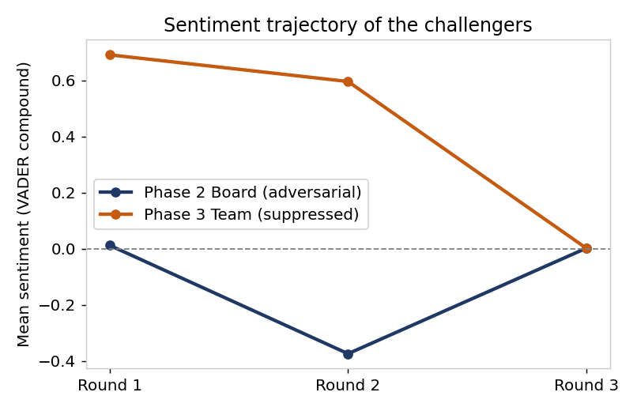
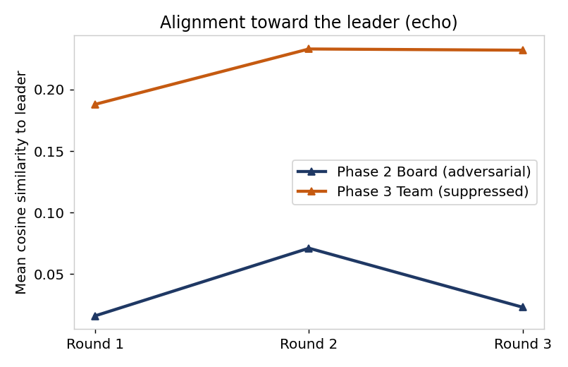
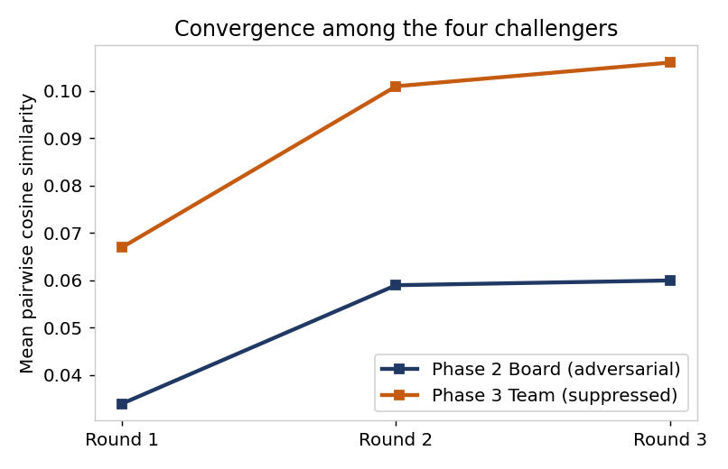
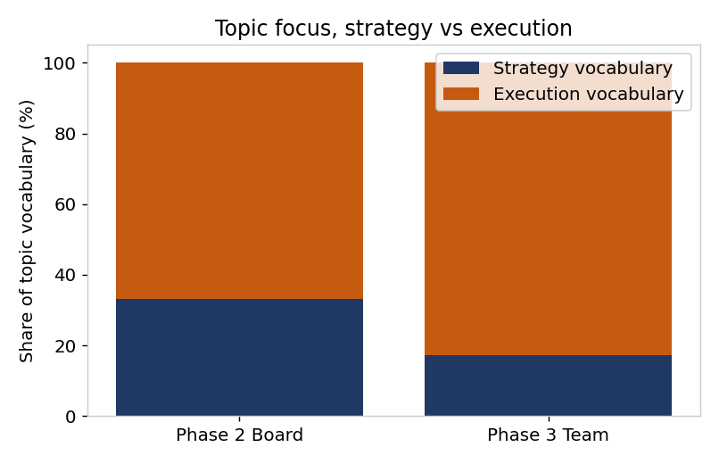

# The Autonomous Boardroom

**Responsible AI governance for multi-agent strategic decisions, tested on an FMCG diversification case.**

Companies are starting to let teams of AI agents debate and shape business decisions. This project asks what happens to the quality of that debate when the agents are allowed to challenge the strategy, compared with when they are not, and what controls a leadership team would need before trusting such a system.

The same strategic decision was run through two AI debates on Claude Opus 5. The transcripts were then measured with a Python NLP pipeline, and every weakness the analysis found was turned into a specific governance control.

## Headline finding

The debate with **less** scrutiny produced **more** confidence.

- A fully autonomous AI board of five executives argued freely and endorsed the plan only conditionally, at **6.1 out of 10**.
- A human-led team cascade, where the four AI managers could raise execution concerns but could not reopen the strategy, rated the same plan at **7.8 out of 10**.

Five independent measures showed the agreeable team was not more convinced, it was less challenged. A smooth AI debate is not a safe one, it is an unmonitored one.

## The five phases

| Phase | What was done |
|---|---|
| 1. Business case | Built a disguised case, "SA Beverages", a listed Indian beverage major (real CY2023 to CY2025 financials) whose growth slowed from about 25% to 8%, deciding whether to diversify into baked snacks under a new brand, "Savories" |
| 2. AI board debate | Five AI executives (CEO, CMO, CFO, COO, CTO) with distinct incentives debated the plan over three rounds with no human input, then scored it |
| 3. Human-led cascade | I played the Product Head and briefed four AI functional leads (Sales, Brand, Supply Chain, R&D) on the board's mandate, using a prompt I wrote that allowed execution concerns only |
| 4. NLP diagnostic | Python analysis of all 33 speaker turns using sentiment (VADER), custom challenge and agreement lexicons, topic models (LDA, NMF) and sentence embeddings |
| 5. Governance | Designed the CANDOR framework, one control per measured weakness, plus decision tiering and a low-cost rollout plan |

## What the analysis measured

| Weakness | AI board (challenge allowed) | Team cascade (challenge suppressed) |
|---|---|---|
| Sentiment smoothing, dissent hidden behind a positive tone | Challengers net negative (-0.12), 0.71 agreement words per 100 | Challengers strongly positive (+0.43), 1.89 agreement words per 100 |
| Echo toward the leader | Similarity to CEO about 0.02 to 0.07 | Similarity to leader about 0.19 to 0.23, roughly 3 times higher |
| Premature convergence, false consensus | Similarity among challengers 0.034 rising to 0.060 | 0.067 rising to 0.106, about twice as convergent |
| Topic narrowing, strategic blind spots | About 34% strategy vocabulary | About 18% strategy vocabulary, the rest execution |
| Confidence inflation | Plan scored 6.1 | Plan scored 7.8 |

## The CANDOR framework

| Control | What it does | Weakness it targets |
|---|---|---|
| **C**ompel Challenge | A designated challenger files objections every round, and each must be cleared with a stated reason | Suppressed dissent |
| **A**uthority-Blind Reasoning | Agents form positions before the leader speaks, and proposals are judged without showing whose they are | Echo toward authority |
| **N**o Premature Consensus | Independent parallel drafts and a mandatory minority report before any synthesis | False consensus |
| **D**efend the Agenda | A standing strategy checkpoint and a fixed risk-coverage checklist inside execution debates | Strategic blind spots |
| **O**versight Calibrated to Contestation | Stated confidence is discounted by how much challenge it received, and high confidence with little dissent triggers human review | Confidence inflation |
| **R**ecord and Monitor | The Phase 4 metrics run automatically on every transcript as a live dashboard, with the adversarial board as the healthy band | All of the above |

Human attention is then tiered by stakes. Low-stakes reversible decisions run autonomously with monitoring, material decisions such as the Savories pilot run semi-autonomously with human checks at gates, and hard-to-reverse decisions such as the diversification itself require human contestation before commitment.

## Repository contents

| Path | Contents |
|---|---|
| `report/The_Autonomous_Boardroom_Report.pdf` | The full paper, covering all five phases, findings, framework and appendix |
| `notebook/SA_Beverages_Phase4_NLP.ipynb` | The Python NLP pipeline with all outputs and charts |
| `data/SA_Beverages_Debate_Dataset.xlsx` | Both labelled debate transcripts, speaker scores and score summaries |
| `figures/` | The five diagnostic charts |

The two debates can be read in full on Claude.
- AI board debate (Phase 2): https://claude.ai/share/86c6c29a-d759-4794-945b-55d2aa56d7ab
- Human-led cascade (Phase 3): https://claude.ai/share/b773bff3-404a-4e79-8952-2528e03bc391

## How it was built

Both debates were run on Claude Opus 5 with high reasoning, so differences between them are not a model artefact. The analysis runs in Google Colab on Python 3 with VADER and scikit-learn. The similarity step tries the sentence-transformers model all-MiniLM-L6-v2 first and falls back to TF-IDF vectors if the model cannot be downloaded. The saved run in this notebook used the TF-IDF fallback, and the report notes the findings hold under both methods. The report rounds a few figures slightly differently from the notebook output, for example 33% and 17% for the strategy share. Claude was used throughout the project, from building the case and running the debates to writing and debugging the analysis code.

## Limitations

The corpus is small, 33 turns, so the numbers are directional rather than precise. The two debates also differ in more than one way (strategy versus execution, five executives versus four managers, autonomous versus human-led), so the suppression of challenge cannot be isolated as the only cause. The weight of the result comes from five independent measures all pointing the same way. A cleaner follow-up would hold everything fixed and vary only the challenge rule across repeated runs, using the same pipeline.

## About

Individual term paper by **Shivam Ahuja** for the Multimodal AI Strategy course at SPJIMR Mumbai, September 2026. The company identity is fictionalized, and its financial figures come from the public annual results of a listed Indian beverage company, named in the report. The board debate used an instructor-provided engine prompt, which is not reproduced here. The cascade prompt I wrote is included in the report appendix.
